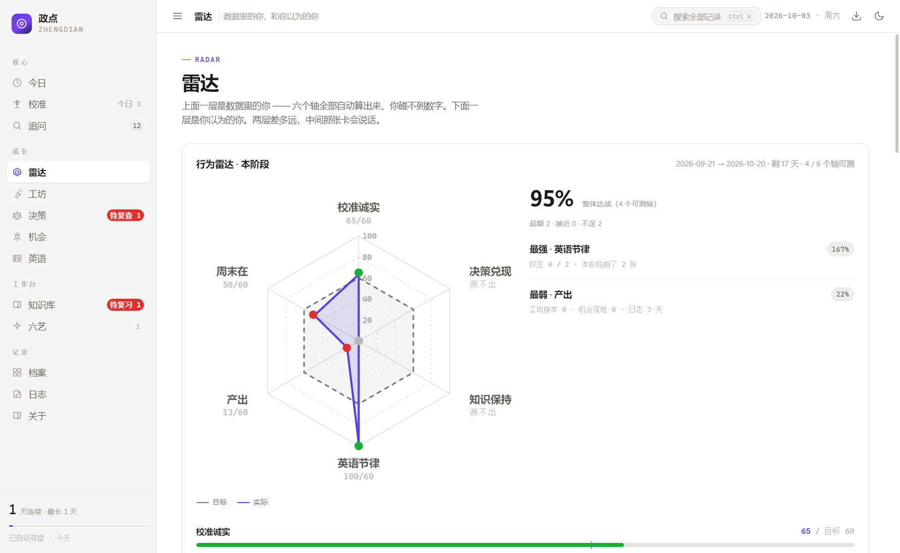
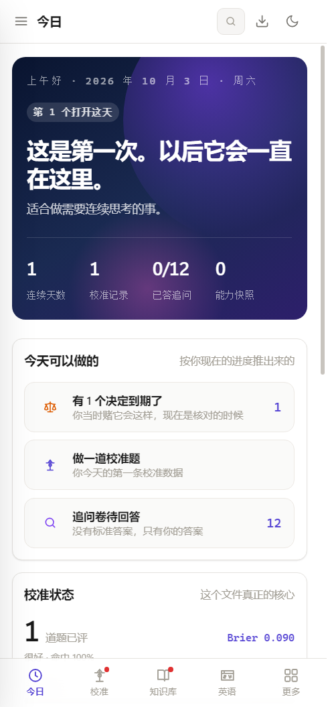

# 政点 zheng

> 写给一个 15 岁、不肯说谎的人。

**一个单文件、零依赖、完全离线的个人成长控制台。**  
打开一个 HTML 文件就能用，不注册、不联网、不上传任何东西。



<p align="center">  
    
</p>

---

## 它是干什么的

大多数"效率工具"在帮你把事做完；这个东西在帮你把自己看清楚。

它由十三个模块组成，可以分成四类：

**核心 —— 让你没法糊弄自己**

| 模块        | 它逼你做什么                                                                    |
| --------- | ------------------------------------------------------------------------- |
| **校准实验室** | 给你一句判断，你给结论、再给出你有多确定。系统长期统计：你说"80% 把握"的那些事，实际对了多少。你不是要显得厉害，你是要知道自己哪里在骗自己。 |
| **追问**    | 一批关于"AI 真正价值"的不好回答的问题。你现在写一遍答案，三个月后回来重写，然后看自己变了多少。                        |
| **今日**    | 把上面这些压成"今天该看的那一件事"。                                                       |

**成长 —— 把过程留下来**

| 模块            | 它记录什么                                                                                                                                                                        |
| ------------- | ---------------------------------------------------------------------------------------------------------------------------------------------------------------------------- |
| **雷达**        | 双层的。上面一层是「数据里的你」：六个轴——校准诚实、决策兑现、知识保持、英语节律、产出、周末在——全部从其他模块的硬数据里自动算出来，你碰不到任何一个数字。你给每期定目标，到期自动对账，目标锁定就改不了。下面一层是「你以为的你」：能力自评。中间那张「认知差」卡，把两层硬碰硬摆在一起——高估标红，低估标绿，没有数据可对账的轴明说"不编数字"。 |
| **Prompt 工坊** | 提示词的版本管理。改一次存一版，版本数比"我研究了很久"实在得多。                                                                                                                                            |
| **决策回执**      | 写下你正要做的决定、你预期会发生什么、你有多确定。到期它会主动来找你回看——人对自己过去的想法有极强的美化能力，这里不给它这个机会。                                                                                                           |
| **机会池**       | 想法、收入、内容的落地清单。                                                                                                                                                               |
| **英语舱**       | 技术英语的间隔重复。到期的卡会在侧边栏冒出来。                                                                                                                                                      |

**工作台 —— 真的能干活**

| 模块      | 它做什么                                                                           |
| ------- | ------------------------------------------------------------------------------ |
| **知识库** | 把自己的资料丢进去，全文检索；不靠模型也能从正文里抽出复习题（问答体直接抽、陈述句挖空），然后按间隔重复复习。每份资料可以标学科——认知差的对照要靠它分账。 |
| **六艺**  | 本地模型的六个工具：数据整理、提示词工坊、文本快刀、代码搭手、自由对话、表格生成。**需要你自己跑一个本地模型**（见下），没有模型时这一页会明确告诉你。  |

**记录 —— 别把走过的日子弄丢**

| 模块     | 它做什么                         |
| ------ | ---------------------------- |
| **档案** | 全年活跃度热力图，你在每个模块留下的痕迹。        |
| **日志** | 每天写三行：今天做了什么 / 学到什么 / 明天做什么。 |
| **关于** | 数据管理：导出、导入、备份。               |

---

## 行为雷达的口径，是为"只有周末能用电脑的人"设计的

大多数效率工具默认你每天都会打开它。现实是很多人的设备时间是受限的——  
比如一个平时住校、只有周末能碰电脑的学生。

所以行为雷达的六个轴全部按「本阶段」统计，不按「近 30 天」：  
阶段多长你自己定（默认 30 天），统计跟着阶段走，不跟着日历走。  
「连续打开多少天」这种对住校生毫无意义的指标被换成了「周末在」——  
阶段内有几个周末、几个周末留了痕，平时碰不到设备不扣分。

目标到期自动对账，归档进历史。到期之前目标改不了，  
想换只能作废重立，作废也留档——没达标就回头把目标改低，  
这条后门从一开始就没留。

---

## 怎么用

### 手机

1. 把 `index.html` 放到一个能访问的地方（GitHub Pages、你自己的服务器、或者直接发到微信再点开）。
2. 用浏览器打开，就能用。
3. 建议「添加到主屏幕」——之后就是一个独立图标，全屏、离线可用，和装了个 App 一样。

> 手机上知识库走浏览器自带的本地存储（IndexedDB），存得下几十 MB 资料。  
> 换手机时用知识库里的「导出资料包」，在新手机「导入资料包」即可。

### 电脑

双击 `index.html`，用 Chrome / Edge / Firefox 打开就行。**能力一点不少。**

想要更完整的版本（能直读磁盘、能连本地模型跑六艺），用 `desktop/` 里的源码自己打一个桌面版，见 [desktop/构建说明.md](desktop/构建说明.md)。

### 最重要的一个习惯

数据只存在你这台机器的浏览器里。**请定期按 `Ctrl+S` 或点右上角的「备份」导出一份 JSON。**  
那份文件才是真正带得走的；浏览器数据会随清理缓存一起消失。

---

## 完全离线的意思

- 没有账号，没有服务器，没有任何一个字节发往外部。
- 网页版加载完就是纯本地运行；断网照样用。
- 「六艺」要连的是**你自己电脑上的** `127.0.0.1:11434`，不是任何云端服务。

## 关于本地模型（六艺那一页）

六艺需要一个跑在本机的模型。装 [Ollama](https://ollama.com)，然后：

```bash
ollama pull qwen2.5:3b          # 主力，约 12 字/秒（这台机器实测）
ollama pull qwen2.5:1.5b        # 备胎，约 22 字/秒
ollama pull nomic-embed-text    # 知识库的向量检索要用
```

然后在「设置」里点一下「让它自己报数」，它会自动列出这台机器上有的模型并实测速度。

**没有模型也完全可以用。** 除六艺之外的十二个模块都不依赖它；知识库也会自动退回纯关键词检索，照样能搜、能出题。

---

## 目录结构

```
├── index.html          整个应用。就这一个文件，没有别的依赖
├── LICENSE             MIT
├── .gitignore
└── desktop/            桌面增强版（Electron）源码
    ├── main.js         主进程：窗口、数据目录、画质开关、截图/自检模式
    ├── preload.js      桥接层：把本地能力安全地交给页面
    ├── package.json
    ├── 构建说明.md
    ├── renderer/
    │   └── index.html  与根目录的 index.html 相同
    └── docs/           截图（desktop/ 与 mobile/ 两套）
```

## 一些实现上的选择

- **单文件。** 没有构建步骤，没有 npm install，没有打包器。`index.html` 里就是全部。
- **数据放哪，想清楚了的。** 结构化记录（校准、日志、卡片、OKR……）放 `localStorage`；资料正文和向量索引太大，放 IndexedDB（网页版）或文件（桌面版）。
- **行为雷达的数字不让用户碰。** 六个轴全部从校准记录、决策回执、复习卡、英语舱、工坊、日志里算出来。样本不够就显示"测不出"，绝不补 0 冒充——一个假的 0 比没有数据撒的谎更大。
- **索引可以重建。** 向量索引是"换个设备就重算"的东西，所以导出备份时不带向量，只带正文——省得备份文件大到没法用。
- **检索有兜底。** 嵌入模型没起、或者干脆没有模型时，知识库自动走纯关键词（TF-IDF 加权），不会因为"模型没准备好"就整个不可用。
- **不撒谎。** 界面上不编造"预计速度"之类的数字；拿不准的地方直接写"这台机器没有可用显卡，点下面让它自己报数"。

## 许可

MIT。随便用，随便改，随便发给别人。

---

*政点 zheng · 建成于 2026-10 · 单文件 · 零依赖 · 完全离线*
